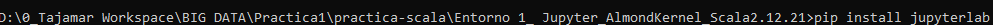
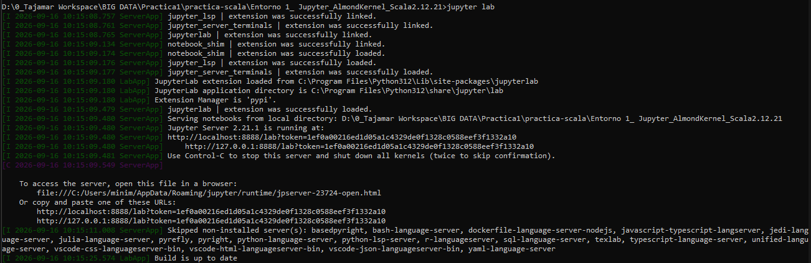
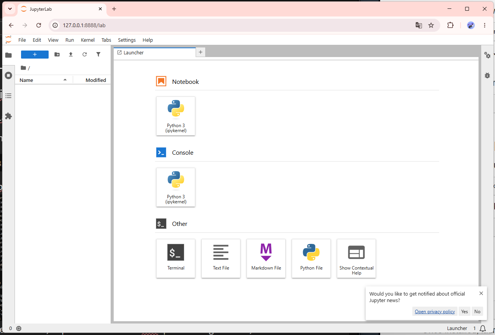
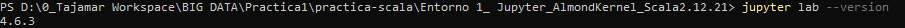
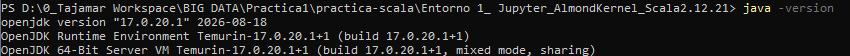
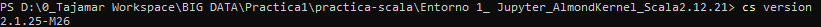
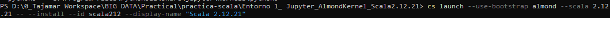
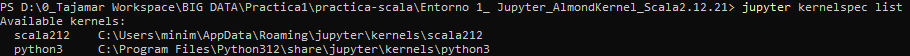
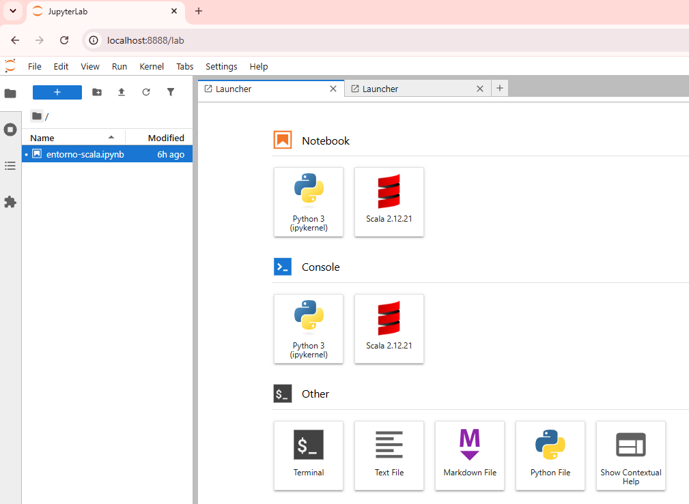

# Práctica 1 - Parte 1: Entornos de Scala


---

# 🟠 Entorno 1 — JupyterLab + Almond Kernel + Scala 2.12.21

## 1.1 Instalación de JupyterLab.
### Requerimientos previos
1. Verificar si la versión de Python es compatible.
2. Actualizar version de `pip`**

```cmd
python -m pip install --upgrade pip
```

```cmd
python -m pip install --upgrade pip
```

---

### Descarga de JupyterLab
Abrimos la consola de comandos **cmd** y escribimos el siguiente comando:
- **Método de instalación:** Gestor de paquetes de Python `pip`
  
```cmd
pip install jupyterlab
```



---

### Inicio del servicio
Se inicia el servicio de JupyterLab desde el powershell y se inicia desde el navegador para acceder a la herramienta.

```powershell
jupyter lab
```

- **Metodo de acceso:** Interfaz web utilizando el URL generado en el levantamiento del servicio (`http://localhost:8888/lab`).
- **Navegador utilizado:** `Google Chrome`.




---

### Verificación de versión de JupyterLab
Ejecutamos el comando para ver la version de JupyterLab.

```powershell
jupyter lab --version
```


---

## 1.2 Instalación de Almond Kernel
### Requerimientos previos
Se deben descargar y añadir al PATH:
1. El gestor de paquetes de scala `coursier`.

```powershell
Invoke-WebRequest -Uri "https://github.com/coursier/launchers/raw/master/cs-x86_64-pc-win32.zip" -OutFile "$env:TEMP\cs.zip"; Expand-Archive -Path "$env:TEMP\cs.zip" -DestinationPath "$HOME\.local\bin" -Force; Rename-Item -Path "$HOME\.local\bin\cs-*.exe" -NewName "cs.exe" -Force; $env:Path += ";$HOME\.local\bin"; [Environment]::SetEnvironmentVariable("Path", "$HOME\.local\bin;" + [Environment]::GetEnvironmentVariable("Path", "User"), "User")
```
> [!NOTE]
> Descarga, extrae, renombra y añade al PATH de Windows la herramienta Coursier (cs) para dejarla lista para usarse desde la terminal.
   
2.  `JDK17`.

```powershell
winget install EclipseAdoptium.Temurin.17.JDK
```
> [!NOTE]
> Descarga e instala de forma desatendida los binarios oficiales de OpenJDK 17 en el sistema.

```powershell
[Environment]::SetEnvironmentVariable("JAVA_HOME", "C:\Program Files\Eclipse Adoptium\jdk-17.0.14.7-hotspot", "Machine")
```
> [!NOTE]
> Configuración de la variable del sistema JAVA_HOME

```powershell
[Environment]::SetEnvironmentVariable("Path", [Environment]::GetEnvironmentVariable("Path", "Machine") + ";C:\Program Files\Eclipse Adoptium\jdk-17.0.14.7-hotspot\bin", "Machine")
```
> [!NOTE]
> Inclusión de la carpeta binaria en el PATH global

---

A continuación, se verifican las versiones de Java cambiado a la version JDK17 y, adicionalmente, también verificamos la versión de coursier.

```powershell
java -version
```

```powershell
cs version
```




---

### Descarga de Almond kernel
Descargamos Almond Kernel desde la powershell de Windows y tras la instalación, verificamos que esté dentro de Jupyter Lab y que al crear un nuevo Notebook aparezca la opción de kernel correspondiente a Scala.

```powershell
cs launch --use-bootstrap almond --scala 2.12.21 -- --install --id scala212 --display-name "Scala 2.12.21"
```





---

### 4️⃣ Verificación de la versión de Scala

Se creó un nuevo Notebook con Almond y se ejecutó una celda para comprobar la versión utilizada:

```scala
[código utilizado para comprobar la versión de Scala]
```


---

### 5️⃣ Ejecución de código Scala

**Prueba 1 — Concatenación de cadenas**

```scala
val nombre = "Scala"
val version = "2.12.21"

println(s"Hola desde $nombre $version")
```


**Prueba 2 — Operación numérica**

```scala
val a = 10
val b = 20
val resultado = a + b

println(resultado)
```


**Prueba 3 — Colección sencilla**

```scala
val lenguajes = List("Scala", "Java", "Python")

println(lenguajes)
```


### ✅ Checklist de evidencias — Entorno 1

- [ ] JupyterLab ejecutándose
- [ ] Almond disponible como kernel
- [ ] Notebook utilizando Scala
- [ ] Versión de Scala utilizada
- [ ] Ejecución correcta de las tres pruebas

---
