# Práctica 1 - Parte 1: Entornos de Scala


---

## Autor
Nombre y apellidos: Emmanuel Grande Sierra
## Entorno
- Sistema operativo: Windows 11
- Scala: 2.12.21
- Java: Temurin JDK 17

---

# 🟠 1. Entorno 1 — JupyterLab + Almond Kernel + Scala 2.12.21

## 1.1 Instalación de JupyterLab.
### Requerimientos previos
1. Verificar si la versión de Python es compatible.
2. Actualizar versión de `pip`.

```cmd
python --version
```

```cmd
python -m pip install --upgrade pip
```

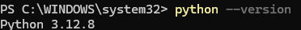

---

### Descarga de JupyterLab
Abrimos la consola de comandos **cmd** y escribimos el siguiente comando:
- **Método de instalación:** Gestor de paquetes de Python `pip`
  
```cmd
pip install jupyterlab
```


---

### Inicio del servicio
Se inicia el servicio de JupyterLab desde el powershell y se inicia desde el navegador para acceder a la herramienta.

```powershell
jupyter lab
```

- **Método de acceso:** Interfaz web utilizando la URL generada al levantar el servicio (`http://localhost:8888/lab`).
- **Navegador utilizado:** `Google Chrome`.


---

### Verificación de versión de JupyterLab
Ejecutamos el comando para ver la version de JupyterLab.

```powershell
jupyter lab --version
```


---

## 1.2 Instalación de Almond Kernel
### Requerimientos previos
Se deben descargar y añadir al PATH:
1. El gestor de paquetes de scala `coursier`.

```powershell
Invoke-WebRequest -Uri "https://github.com/coursier/launchers/raw/master/cs-x86_64-pc-win32.zip" -OutFile "$env:TEMP\cs.zip"; Expand-Archive -Path "$env:TEMP\cs.zip" -DestinationPath "$HOME\.local\bin" -Force; Rename-Item -Path "$HOME\.local\bin\cs-*.exe" -NewName "cs.exe" -Force; $env:Path += ";$HOME\.local\bin"; [Environment]::SetEnvironmentVariable("Path", "$HOME\.local\bin;" + [Environment]::GetEnvironmentVariable("Path", "User"), "User")
```
> [!NOTE]
> Descarga, extrae, renombra y añade al PATH de Windows la herramienta Coursier (cs) para dejarla lista para usarse desde la terminal.
   
2.  `JDK17`.

```powershell
winget install EclipseAdoptium.Temurin.17.JDK
```
> [!NOTE]
> Descarga e instala de forma desatendida los binarios oficiales de OpenJDK 17 en el sistema.

```powershell
[Environment]::SetEnvironmentVariable("JAVA_HOME", "C:\Program Files\Eclipse Adoptium\jdk-17.0.14.7-hotspot", "Machine")
```
> [!NOTE]
> Configuración de la variable del sistema JAVA_HOME

```powershell
[Environment]::SetEnvironmentVariable("Path", [Environment]::GetEnvironmentVariable("Path", "Machine") + ";C:\Program Files\Eclipse Adoptium\jdk-17.0.14.7-hotspot\bin", "Machine")
```
> [!NOTE]
> Inclusión de la carpeta binaria en el PATH global

---

A continuación, se comprueba que el comando `java` apunta a la versión JDK 17 instalada y, adicionalmente, se verifica la versión de `Coursier`.

```powershell
java -version
```

```powershell
cs version
```


---

### Descarga de Almond kernel
Descargamos Almond Kernel desde la powershell de Windows y tras la instalación, verificamos que esté dentro de Jupyter Lab y que al crear un nuevo Notebook aparezca la opción de kernel correspondiente a Scala.

```powershell
cs launch --use-bootstrap almond --scala 2.12.21 -- --install --id scala212 --display-name "Scala 2.12.21"
```


---

## 1.3 Verificación de la versión de Scala
Se creó un nuevo Notebook con Almond y se ejecutó una celda para comprobar la versión utilizada:

```scala
println(scala.util.Properties.versionNumberString)
```

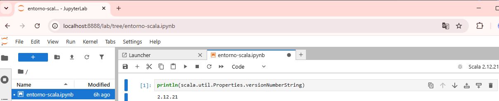

---

## 1.4. Ejecución de código Scala
En el Notebook se han creado varias celdas en las que se han ejecutado los siguientes ejemplos:

**Prueba 1 — Interpolación de cadenas**

```scala
val nombre = "Scala"
val version = "2.12.21"

println(s"Hola desde $nombre $version")
```

**Prueba 2 — Operación numérica**

```scala
val a = 10
val b = 20
val resultado = a + b

println(resultado)
```

**Prueba 3 — Colección sencilla**

```scala
val lenguajes = List("Scala", "Java", "Python")

println(lenguajes)
```

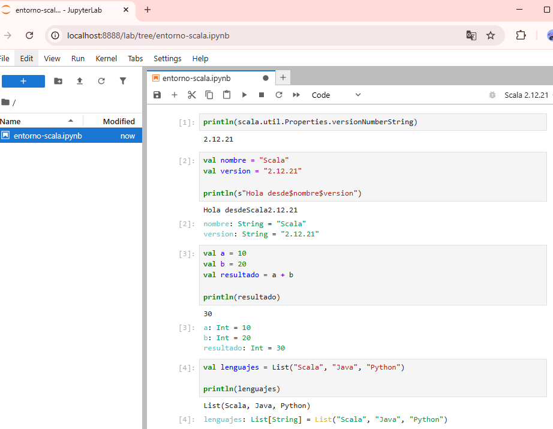

---

# 🔵 2. Entorno 2 — Visual Studio Code + Metals + Scala 2.12.21 + JDK 17 + sbt

## 2.1 Verificación de JDK 17
### Ejecución de los comandos de versión
Se muestra la ejecución de los comandos en PowerShell para comprobar tanto el runtime de Java como el compilador:

```powershell
java -version
```

```powershell
javac -version
```

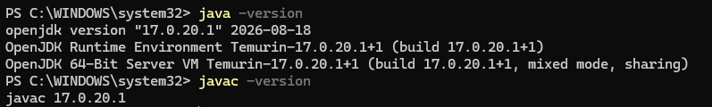

---

## 2.2 Instalación de Visual Studio Code
Se disponía previamente del editor de código Visual Studio Code en Windows 11.

- **Enlace de descarga:** [Visual Studio Code](https://code.visualstudio.com)


---

### Verificación de la instalación
Se inicia Visual Studio Code y se documentan tanto la pantalla principal con las notas de la versión como la versión del binario en la terminal.

```powershell
code --version
```

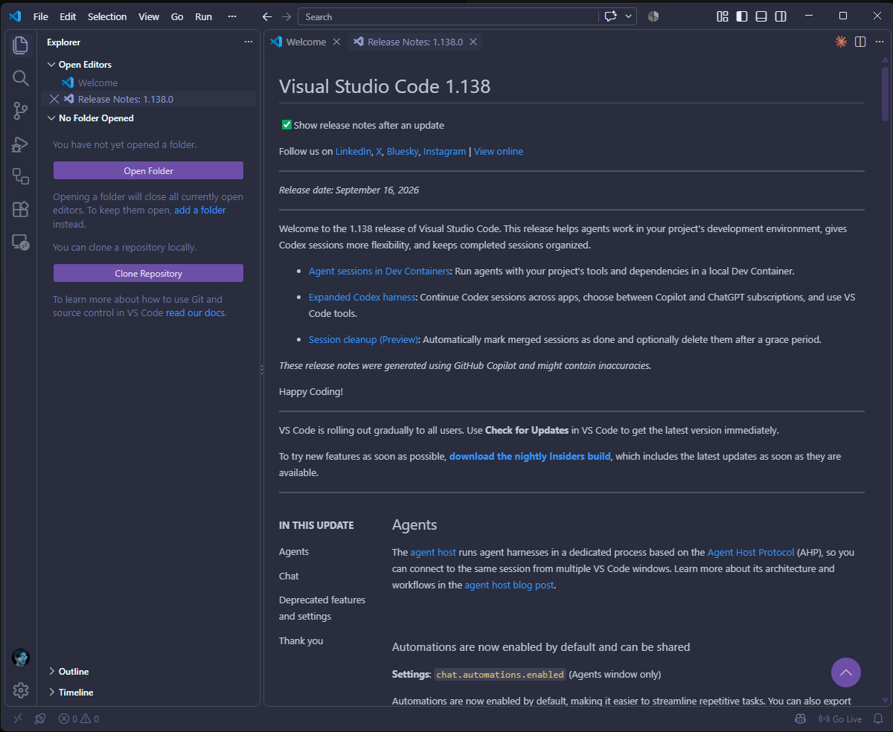
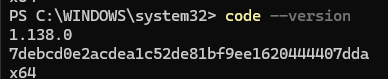

---

## 2.3 Instalación de Metals
Metals proporciona a Visual Studio Code funciones avanzadas de IDE para Scala (autocompletado, detección de errores en tiempo real, navegación y compilación) mediante el protocolo LSP.

### Búsqueda e Instalación de la extensión
1. Se accedió al panel lateral *Extensions* (`Ctrl + Shift + X`) para buscar e instalar el paquete oficial `Scala (Metals)` de *Scalameta*.

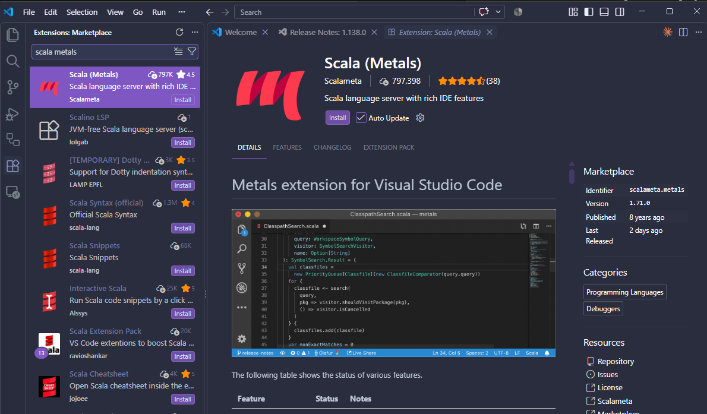

2. Tras completarse la instalación, se validó la inicialización del servicio a través de la ventana de Release Notes.

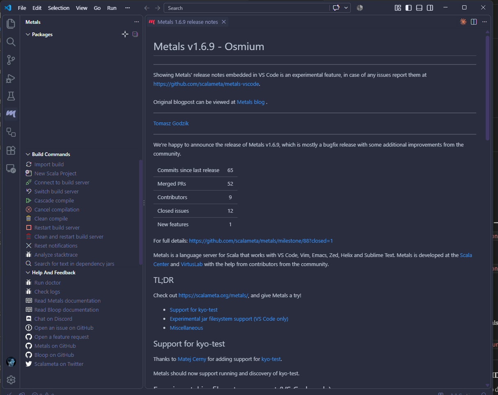

3. Se comprobó en la sección de extensiones instaladas que tanto Metals como su analizador de sintaxis oficial están activos.

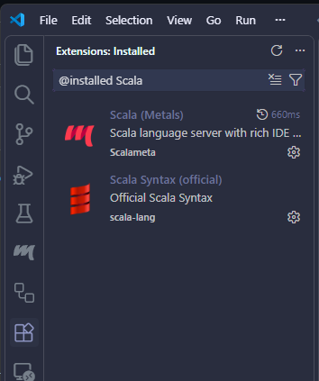

---

## 2.4 Instalación y comprobación de sbt
**sbt** (*Simple Build Tool*) es la herramienta oficial y estándar de construcción para el ecosistema Scala, encargada de resolver dependencias, administrar versiones del compilador y orquestar la compilación del proyecto.

### Proceso de instalación
1. Se instala la herramienta mediante el gestor de paquetes Coursier.
```powershell
cs install sbt
```

2. Se verifica que el comando esté disponible en el sistema y se comprueba la versión instalada.
```powershell
sbt --version
```

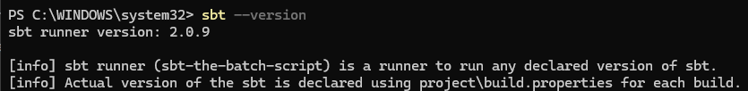

---

## 2.5 Creación del proyecto sbt scala-vscode
Se creó el espacio de trabajo `scala-vscode` respetando el estándar de diseño de proyectos de sbt para el entorno de desarrollo.

### Generación de la estructura del proyecto
- **Creación de la estructura de directorios.**
Desde la terminal PowerShell se creó la carpeta raíz del proyecto junto a las subcarpetas requeridas para la compilación y el código fuente:

```powershell
mkdir scala-vscode
cd scala-vscode
mkdir project
mkdir src\main\scala
```

- **Generación de archivos build.sbt y Main.scala.**
Se abrió la raíz del proyecto en Visual Studio Code y se crearon a mano los archivos restantes del proyecto.

### Verificación de estructura del proyecto
Verificada la estructura del proyecto Scala con sbt desde la Powershell.

```powershell
tree /F
```

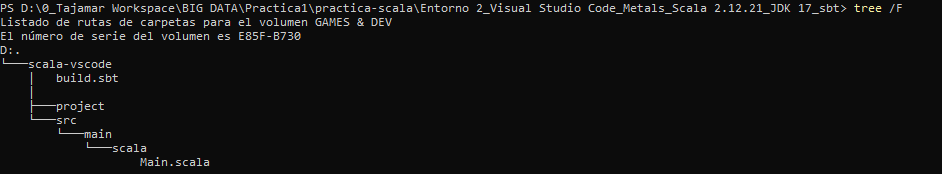

--- 

## 2.6 Configuración de Scala 2.12.21 en sbt
En la raíz del proyecto se configuró el descriptor de construcción `build.sbt` para definir los metadatos base y forzar la versión exacta del compilador de Scala solicitada:

```scala
name := "scala-vscode"

scalaVersion := "2.12.21"
```

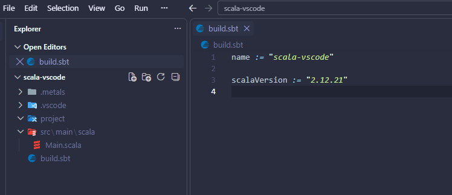

---

## 2.7 Creación del programa principal
Se definió el punto de entrada de la aplicación en la ruta src/main/scala/Main.scala extendiendo el trait App para permitir su ejecución directa:

```scala
object Main extends App {

  val entorno = "Visual Studio Code"

  println("Práctica de programación básica con Scala")
  println(s"Ejecutando desde: $entorno")
}
```

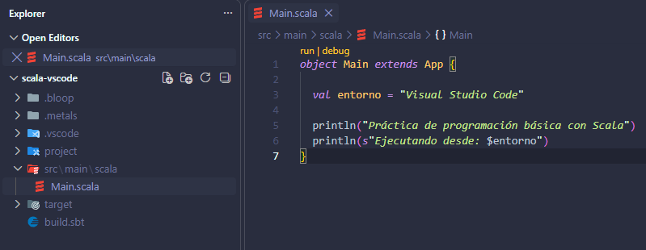

---

## 2.8 Importación del proyecto con Metals

Para que el servidor de lenguaje proporcione asistencia de código y compile de forma incremental, es necesario importar la configuración de compilación de sbt dentro del entorno de desarrollo.

### Proceso de importación y sincronización
1. Con la carpeta `scala-vscode` abierta en Visual Studio Code, la extensión Metals identificó automáticamente el archivo `build.sbt` en la raíz.
2. Se aceptó la notificación emergente pulsando en **"Import build"** para sincronizar las definiciones del proyecto y descargar los metadatos necesarios.

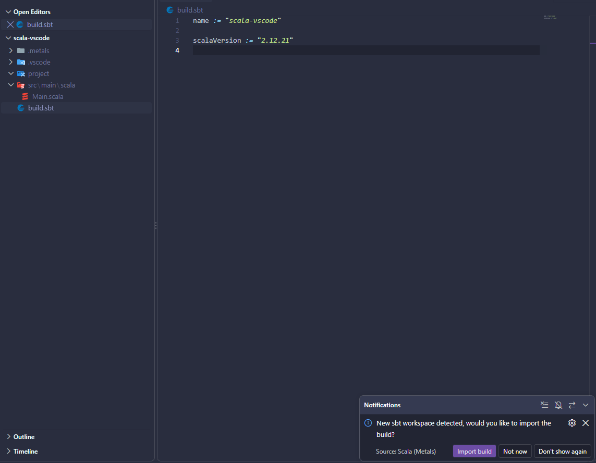

---

### Verificación del proyecto reconocido por Metals
Una vez finalizada la indexación:
- El panel lateral de **Metals** (`Build Commands`) muestra el proyecto `scala-vscode` conectado activamente al servidor de compilación (*Bloop*).
- En la barra de estado inferior se confirma la conexión al servidor de lenguaje y la versión del compilador activa (`Scala 2.12.21`).

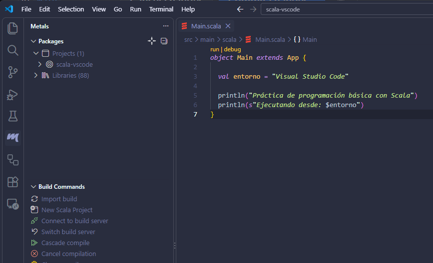


---

9️⃣ Compilación del proyecto
powershell
sbt compile

Mostrar imagen

🔟 Ejecución del proyecto
powershell
sbt run

Mostrar imagen

✅ Checklist de evidencias — Entorno 2
 Resultado de java -version
 Visual Studio Code instalado
 Extensión Metals instalada
 Resultado de sbt --version
 Estructura del proyecto
 Contenido de build.sbt
 Scala 2.12.21 configurado
 Archivo Main.scala
 Proyecto reconocido por Metals
 Ejecución de sbt compile
 Ejecución correcta de sbt run
